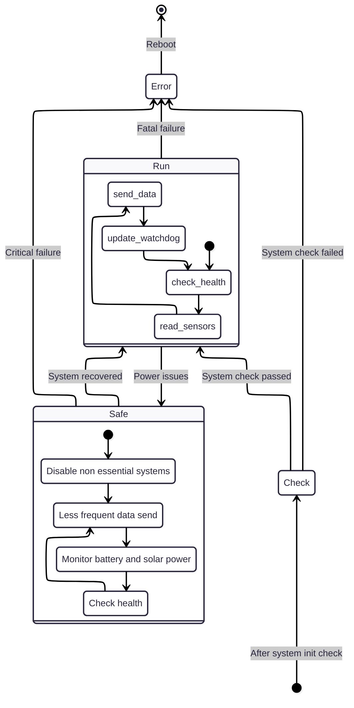

# State machine diagram

- 07.09.2026

```mermaid
---
config:
  theme: redux
  layout: elk
---
stateDiagram
  direction BT
  state Run {
    direction TB
    [*] --> check_health
    check_health --> read_sensors
    read_sensors --> send_data
    send_data --> update_watchdog
    update_watchdog --> check_health
[*]    check_health
    read_sensors
    send_data
    update_watchdog
  }
  state Safe {
    direction TB
    [*] --> nes
    nes --> lfl
    lfl --> mbs
    mbs --> chh
    chh --> lfl
[*]    nes
    lfl
    mbs
    chh
  }
  [*] --> Check:After system init check
  Check --> Run:System check passed
  Check --> Error:System check failed
  Run --> Safe:Power issues
  Run --> Error:Fatal failure
  Safe --> Error:Critical failure
  Safe --> Run:System recovered
  Error --> [*]:Reboot
  nes:Disable non essential systems
  lfl:Less frequent data send
  mbs:Monitor battery and solar power
  chh:Check health

```